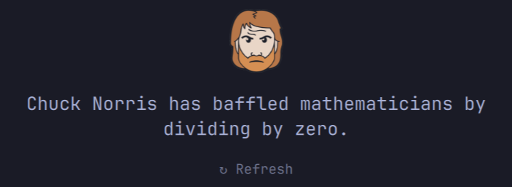

# Chuck Norris

Random Chuck Norris jokes in the [Omarchy](https://omarchy.org/) Quattro bar. Shows a Plasticine Chuck Norris icon; hover reveals the joke as a tooltip, click opens a popup with the full joke, right-click fetches a new one.



## Depends

- `curl` — fetches jokes from `https://api.chucknorris.io/jokes/random`
- Network access to `api.chucknorris.io`

The plugin runs unsandboxed inside the long-lived `omarchy-shell` process and shells out to `curl`. A new joke is fetched every 5 minutes and whenever the popup is opened or right-clicked.

## Install

```sh
omarchy plugin add https://github.com/paulhocker/omarchy-plugin-chuck.git --enable
```

Place it:

```sh
omarchy bar move paulhocker.omarchy-plugin-chuck --section left
```

## Remove

```sh
omarchy plugin remove paulhocker.omarchy-plugin-chuck
```

## License

MIT — see [LICENSE](LICENSE).
